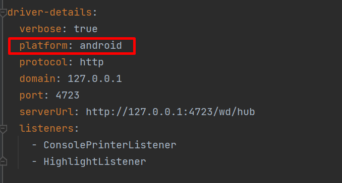
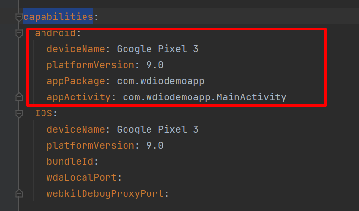
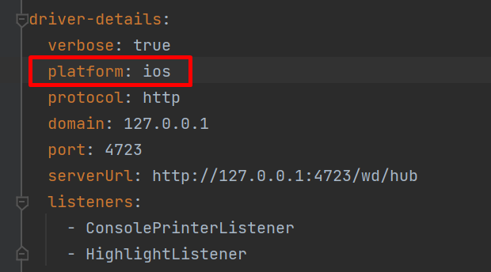
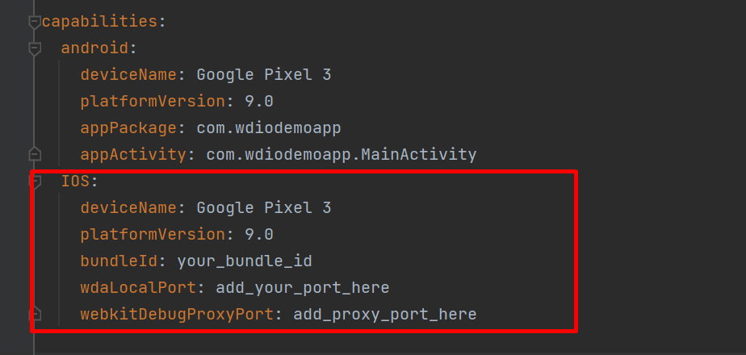
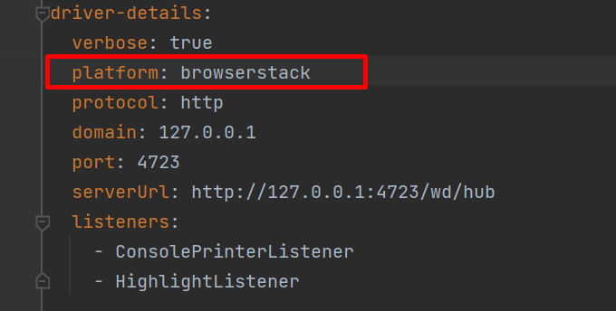
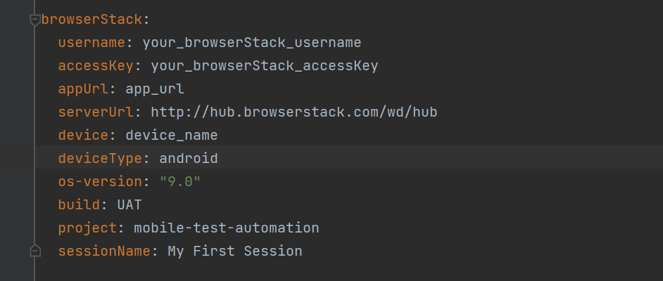

# mobile test automation
This repository uses Selenium, via appium that connects to Android/IOS.

## Based on

This Framework is based on:

- **Java:** `8`
- **Appium:** `1.20.#`
- **Selenium**
- **Maven**
- **TestNg**
- **Browserstack**

## Prerequisites

### Installing Appium on a local machine

See [Installing Appium on a local machine](./docs/APPIUM.md)

### Setting up Android and iOS on a local machine

To setup your local machine to use an Android emulator and an iOS simulator see
[Setting up Android and iOS on a local machine](docs/ANDROID_IOS_SETUP.md)

## How to implement in your project

Choose one of the following options:

1. Clone the git repo
2. Move to root directory of framework (mobile-test-automation-java-selenium)
3. Place your apps in  ["/src/test/resources/apps"](./src/test/resources/apps)
4. Change/Add an environment YAML file as per your requirement
   from [/src/test/resources/configs](./src/test/resources/configs)
5. Run the tests using command `mvn clean test -DconfigPath=configs/{env-file-name}.yaml`

   > ###### # Sample :
   > mvn clean test -DconfigPath=configs/demo.yaml

6. To see the tests result,
   Open [`target/surefire-reports/ExtentReportsTestNG.html`](./target/surefire-reports/ExtentReportsTestNG.html) file in
   a browser. `ExtentReportsTestNG.html` file will be available only when test will be completed.

## Configuration files

This framework uses a specific config for iOS and Android, see [configs](./src/test/resources/configs). The configs are
based on a shared config
[`demo.yaml`](./src/test/resources/configs/demo.yaml). This config holds all the defaults, capabilities, timeouts.

## Android

To run test on an android few changes are required from config file:

- ***Set `platform=android` under `driver-details`***.



- ***Add android capabilities in `capabilities.android`***



## IOS

To run test on an IOS few changes are required from config file:

- ***Set `platform=android` under `driver-details`***.



- ***Add android capabilities in `capabilities.android`***



## BrowserStack

This framework provides a setup for testing with BrowserStack. Please check
the [BrowserStack](./src/test/resources/configs)
-folder to see the setup for iOS and Android.

There are few changes required from config to run on browserstack:

- ***set platform to browserstack***



- ***Add browserstack default capabilities***



### How to get appUrl:
> Upload an app using the file manager to generate an "app_url" value. It uniquely identifies your uploaded app on BrowserStack.
`{"app_url":"bs://<app-id>"}`.
> ####OR
> Use our REST API to upload an Android app (.apk or .aab file) or an iOS app (.ipa file) from your local filesystem. Use the command-line tool cURL to upload your app as shown below :
> 
>```curl -u "username:accessKey" -X POST "https://api-cloud.browserstack.com/app-automate/upload" -F "file=@/path/to/app/file/Application-debug.apk"```